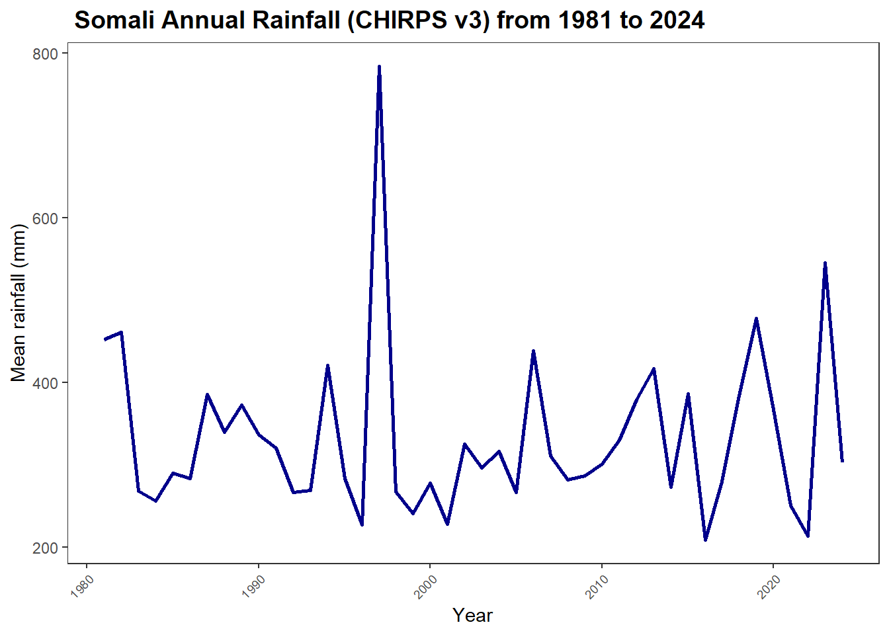
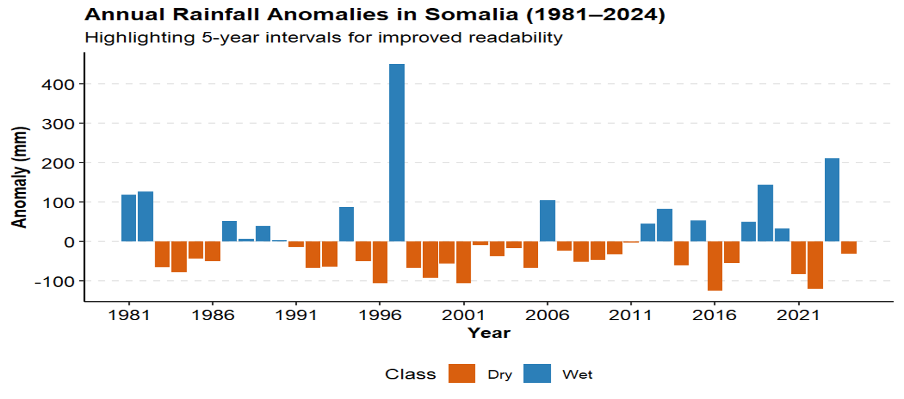
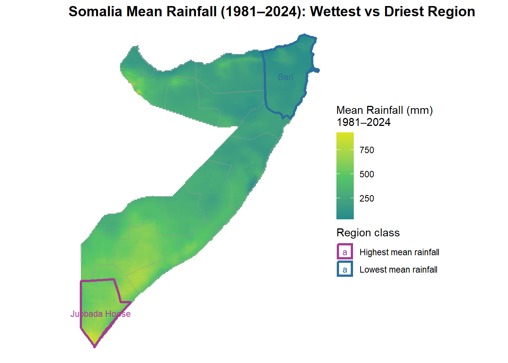
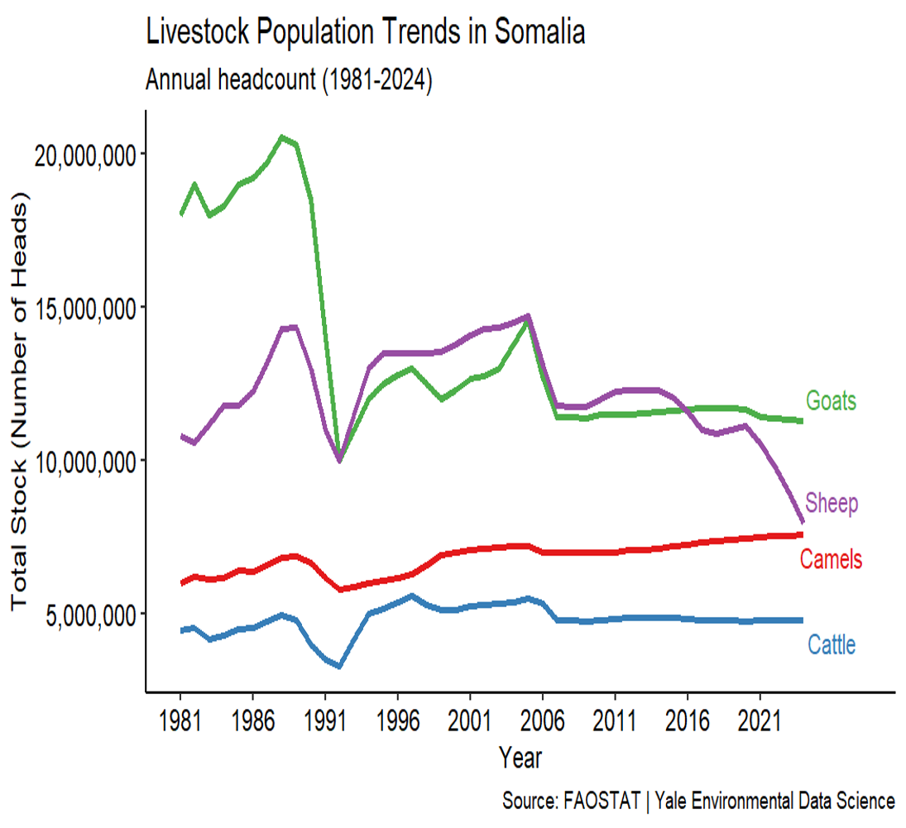
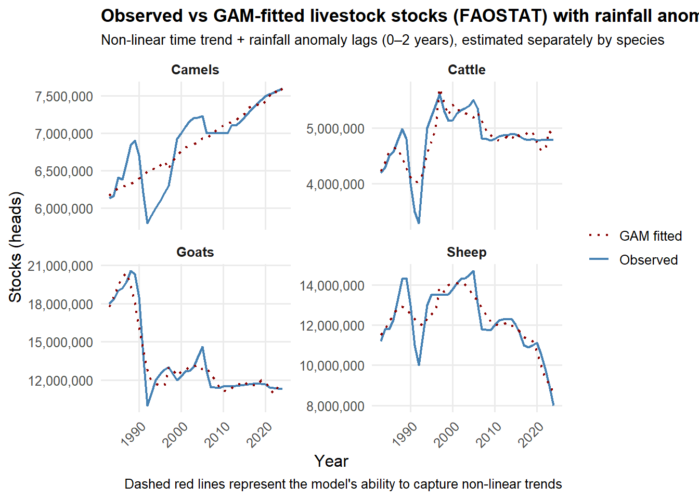

### **Climate Livestock Dynamics in Somalia: Rainfall Trends and Shifts in Pastoral Livestock Stock Across Somalia \(1981–2024\)**

Author: Mohamed Said  
Date: March 2026  

---

### Environmental Research Question: 

 How do long-term rainfall trends influence density changes of goats, sheep, and camels across Somalia?

---

#### Summary

This project analyzes long-term rainfall variability and its relationship with livestock population dynamics in Somalia using climate and livestock datasets. The goal is to understand how rainfall trends influence pastoral systems and livestock density changes.

---

#### Rationale

Somalia’s economy and livelihoods are highly dependent on pastoralism. Climate variability, particularly rainfall fluctuations and droughts, directly affects livestock health and carrying capacity. Understanding these relationships is important for improving resilience, informing policy, and supporting sustainable resource management.

#### Data Sources

- Rainfall data preprocessing (clipping, aggregation)
- Rainfall anomaly calculation
- Exploratory data analysis (EDA)
- Livestock time-series analysis
- Climate–livestock modeling (GAM)

---

#### Study Scope

- **Period**: `1980- 2026`
- **Location**: `Somalia (national and regional levels)`
- **Frequency**:`Annual`

---

#### Methodology

- Rainfall data preprocessing (clipping, aggregation)
- Rainfall anomaly calculation
- Exploratory data analysis (EDA)
- Livestock time-series analysis
- Climate–livestock modeling (GAM)

---

#### Exploratory Data Analysis (EDA)

##### 1. Climate EDA (CHIRPS v3 Dataset, 1981–2024)

The analysis shows that Somalia's rainfall is dominated by extreme interannual variability, rather than a consistent long-term trend.  

**Long-term Trend:** The Mann–Kendall  test confirms no significant monotonic trend ($p \approx 0.992$). Sen’s slope is near zero ($\approx 0.020$ mm/yr), indicating negligible long-term change.  

**Distribution Profile:** Rainfall distribution is positively skewed. Most years cluster between 250 mm and 380 mm, with occasional extremely wet years pulling the mean upward.  

**Key Statistical Results:**  

- **Long-term Mean:** 333.72 mm  
- **Standard Deviation:** 103.26 mm (highlighting high variability)  
- **Extreme Years:**  
  - **Wettest Year:** 1997 (+450.6 mm anomaly)  
  - **Driest Year:** 2016 (-124.6 mm anomaly)  

**Spatial Variability:**  

- Wet years (e.g., 1997, 2019) often show high spatial standard deviation, meaning rainfall was unevenly distributed.  
- Dry years (e.g., 2016, 2021) tend to show low spatial variability, indicating widespread, uniform dryness.  

---

##### 2. Livestock EDA (FAOSTAT Dataset, 1981–2024)

Livestock populations show **species-specific trajectories**, reflecting differing climate resilience and market factors.  

**Species Trends:**  

- **Camels (Increasing):** Significant long-term increase, suggesting pastoralists may favor drought-resilient animals.  
- **Goats (Declining):** Substantial decline since 1981 baseline, despite expectations.  
- **Cattle & Sheep:** Cattle remain relatively stable, while sheep show a weak downward trend.  

**Year-over-Year Dynamics:**  

- Livestock stocks do not perfectly mirror annual rainfall, suggesting other factors influence population dynamics:  
  - Socio-economic conditions  
  - Conflict  
  - Pastoral mobility and management strategies 
  

#### Final Analysis and Visualizations

**1. Somalis Annual Rainfall time series and Anomalies**

These figures show the annual rainfall patterns in Somalia over the period 1981–2024.  

- The first figure displays the annual rainfall map across Somalia, highlighting spatial differences.  
- The second figure shows annual rainfall anomalies, identifying years with unusually dry or west years.  
- The third figure highlights mean rainfall raster, greyed-out regions, and marks areas with the highest and lowest rainfall.

**2. Levels Trend Over Time (Livestock Stocks)**

This figure presents livestock stock trends over time by species from FAOSTAT.  

- Highlights long-term changes, seasonal variation, and species-specific patterns, helping identify vulnerable periods for livestock.  

**3. Observed vs GAM-fitted Livestock Stocks**

This figure compares observed livestock stocks with GAM-fitted values while accounting for rainfall anomaly lags from CHIRPS data.   

- Allows assessment of model fit and how rainfall anomalies influence livestock numbers over time.

#### Acknowledging Limitations

Livestock trends reflect climate plus markets, conflict, and pastoral mobility. National rainfall averages may hide important regional climate impacts. Future work should integrate regional climate indicators and socio-economic data.

---

#### Results for Non-Technical Audience

- **Rainfall:** Shows no long-term trend, but exhibits strong year-to-year variability, with wet and dry years occurring unpredictably.  
- **Livestock Response:** Different species respond differently to climate variability:  
  - **Camels:** Populations are increasing, likely due to their drought resilience.  
  - **Goats:** Populations are declining over time.  
  - **Cattle:** Populations remain relatively stable.  .  

---

#### File Organization

- `data/raw_data/` - Original CHIRPS rainfall and FAOSTAT livestock data
- `data/processed_data/` - Processed and transformed datasets
- `data/clean_data/` - Analysis-ready datasets
- `data/gis_data/` - Spatial data (GADM shapefiles)
- `data/metadata/` - Data documentation and descriptions
- `data/archive/` - Legacy and unused data
- `scripts/` - R scripts for data processing and analysis
- `outputs/` - Mps, figures, tables, and results
- `reports/` - RMarkdown, PDF, and presentation report
- `references/` - reference

---

#### Requirements

| Tool           | Purpose                                |
|----------------|----------------------------------------|
| `R`            | Data analysis and modeling             |
|`Bash / Python` | File management and Git operations     |
| `CoCalc`       | Cloud-based development environment    |
|`Git & GitHub`  | Version control and project management |

#### Ethical Considerations

| **Aspect** | **Description**                                    |
| :----------:| ---------------------------------------------------|
| Privacy     | No personal data is included                       |
| Governance  | Data is openly available and ethically sourced     |
| Bias        | Potential dataset and analytical biases considered |

---

#### Instructions for Reproducing Project

To reproduce this project, follow these steps:  

1. **Clone the GitHub repository.**  
2. **Install required software and libraries:**  
   - R (or RStudio)  and Required packages  
3. **Open and run the provided Jupyter notebook or R Markdown file.** 
4. **Follow code and instructions to reproduce figures and analyses.**  

#### Contact

Mohamed Said  
[Email](mailto:mbsaid93@gmail.com) 

#### License

MIT License

_Copyright © 2026 Mohamed Said. All rights reserved_

